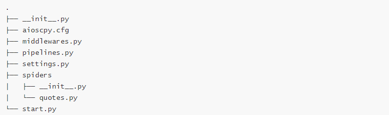
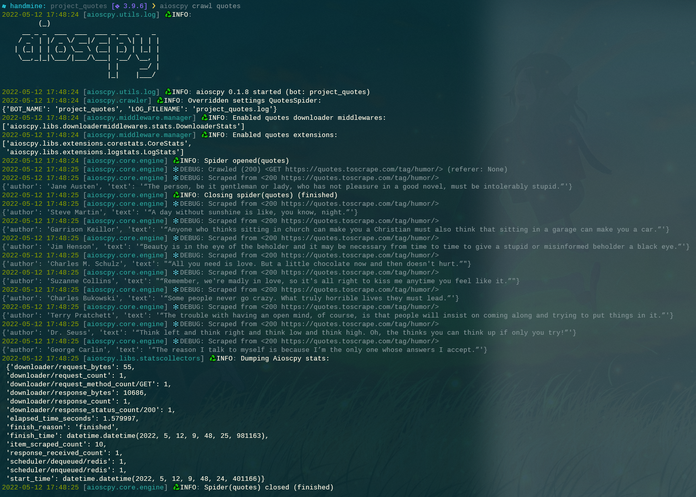

### Aioscpy

An asyncio + aiolibs crawler  imitate scrapy framework


### Overview

Aioscpy framework is base on opensource project Scrapy & scrapy_redis.

Aioscpy is a fast high-level web crawling and web scraping framework, used to crawl websites and extract structured data from their pages.

Dynamic variable injection is implemented and asynchronous coroutine feature support.

Distributed crawling/scraping.

### Requirements

- Python 3.7+
- Works on Linux, Windows, macOS, BSD

### Install

The quick way:

```shell
pip install aioscpy
```

### Usage

create project spider:

```shell
aioscpy startproject project_quotes
```

```
cd project_quotes
aioscpy genspider quotes 
```



quotes.py:

```python
from aioscpy.spider import Spider


class QuotesSpider(Spider):
    name = 'quotes'
    custom_settings = {
        "SPIDER_IDLE": False
    }
    start_urls = [
        'https://quotes.toscrape.com/tag/humor/',
    ]

    async def parse(self, response):
        for quote in response.css('div.quote'):
            yield {
                'author': quote.xpath('span/small/text()').get(),
                'text': quote.css('span.text::text').get(),
            }

        next_page = response.css('li.next a::attr("href")').get()
        if next_page is not None:
            yield response.follow(next_page, self.parse)

```

create single script spider:

```shell
aioscpy onespider single_quotes
```

single_quotes.py:

```python
from aioscpy.spider import Spider
from anti_header import Header
from pprint import pprint, pformat


class SingleQuotesSpider(Spider):
    name = 'single_quotes'
    custom_settings = {
        "SPIDER_IDLE": False
    }
    start_urls = [
        'https://quotes.toscrape.com/tag/humor/',
    ]

    async def process_request(self, request):
        request.headers = Header(url=request.url, platform='windows', connection=True).random
        return request

    async def process_response(self, request, response):
        if response.status in [404, 503]:
            return request
        return response
    
    async def process_exceptions(self, request, exc):
        raise exc

    async def parse(self, response):
        item = {
            # 'hot': '\n'.join(response.xpath('//span[@class="title-content-title"]/text()').extract()),
        }
        yield item

    async def process_item(self, item):
        self.logger.info("{item}", **{'item': pformat(item)})


if __name__ == '__main__':
    quotes = QuotesSpider()
    quotes.start()
```

run the spider:

```shell
aioscpy crawl quotes
aioscpy runspider quotes.py
```



start.py:

```python
from aioscpy import call_grace_instance
from aioscpy.utils.tools import get_project_settings


def load_file_to_execute():
    process = call_grace_instance("crawler_process", get_project_settings())
    process.load_spider(path='./spiders')
    process.start()


def load_name_to_execute():
    process = call_grace_instance("crawler_process", get_project_settings())
    process.crawl('[spider_name]')
    process.start()
```

more commands:

```shell
aioscpy -h
```

### Ready 

please submit your sugguestion to owner by issue

## Thanks

[aiohttp](https://github.com/aio-libs/aiohttp/)

[scrapy](https://github.com/scrapy/scrapy)

[loguru](https://github.com/Delgan/loguru)
