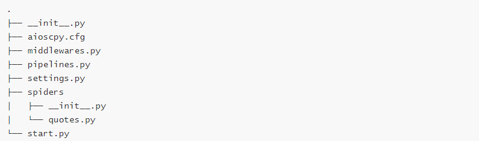

# Aioscpy

一个强大的、高性能的异步Web爬取和抓取框架，基于Python的asyncio生态系统构建。

[英文](../README.md) | 中文

## 概述

Aioscpy是一个快速的高级web爬行和web抓取框架，用于抓取网站并从其页面提取结构化数据。它受到Scrapy和scrapy_redis的启发，但从头开始设计，充分利用异步编程的全部功能。

### 主要特点

- **完全异步**：基于Python的asyncio，实现高性能并发操作
- **Scrapy风格的API**：为来自Scrapy的用户提供熟悉的API
- **分布式爬取**：支持使用Redis进行分布式爬取
- **多种HTTP后端**：支持aiohttp、httpx和requests
- **动态变量注入**：强大的依赖注入系统
- **灵活的中间件系统**：可定制的请求/响应处理管道
- **强大的数据处理**：用于处理爬取数据的管道

## 系统要求

- Python 3.8+
- 支持Linux、Windows、macOS、BSD

## 安装

### 基本安装

```shell
pip install aioscpy
```

### 安装所有依赖

```shell
pip install aioscpy[all]
```

### 安装特定HTTP后端

```shell
pip install aioscpy[aiohttp,httpx]
```

### 从最新版本安装

```shell
pip install git+https://github.com/ihandmine/aioscpy
```

## 快速开始

### 创建新项目

```shell
aioscpy startproject myproject
cd myproject
```

### 创建爬虫

```shell
aioscpy genspider myspider
```

这将在`spiders`目录中创建一个基本爬虫。



### 示例爬虫

```python
from aioscpy.spider import Spider


class QuotesSpider(Spider):
    name = 'quotes'
    custom_settings = {
        "SPIDER_IDLE": False
    }
    start_urls = [
        'https://quotes.toscrape.com/tag/humor/',
    ]

    async def parse(self, response):
        for quote in response.css('div.quote'):
            yield {
                'author': quote.xpath('span/small/text()').get(),
                'text': quote.css('span.text::text').get(),
            }

        next_page = response.css('li.next a::attr("href")').get()
        if next_page is not None:
            yield response.follow(next_page, self.parse)
```

### 创建单个爬虫脚本

```shell
aioscpy onespider single_quotes
```

### 高级爬虫示例

```python
from aioscpy.spider import Spider
from anti_header import Header
from pprint import pprint, pformat


class SingleQuotesSpider(Spider):
    name = 'single_quotes'
    custom_settings = {
        "SPIDER_IDLE": False
    }
    start_urls = [
        'https://quotes.toscrape.com/',
    ]

    async def process_request(self, request):
        request.headers = Header(url=request.url, platform='windows', connection=True).random
        return request

    async def process_response(self, request, response):
        if response.status in [404, 503]:
            return request
        return response

    async def process_exception(self, request, exc):
        raise exc

    async def parse(self, response):
        for quote in response.css('div.quote'):
            yield {
                'author': quote.xpath('span/small/text()').get(),
                'text': quote.css('span.text::text').get(),
            }

        next_page = response.css('li.next a::attr("href")').get()
        if next_page is not None:
            yield response.follow(next_page, callback=self.parse)

    async def process_item(self, item):
        self.logger.info("{item}", **{'item': pformat(item)})


if __name__ == '__main__':
    quotes = SingleQuotesSpider()
    quotes.start()
```

### 运行爬虫

```shell
# 从项目中运行爬虫
aioscpy crawl quotes

# 运行单个爬虫脚本
aioscpy runspider quotes.py
```


### 从代码中运行

```python
from aioscpy.crawler import call_grace_instance
from aioscpy.utils.tools import get_project_settings

# 方法1：从目录中加载所有爬虫
def load_spiders_from_directory():
    process = call_grace_instance("crawler_process", get_project_settings())
    process.load_spider(path='./spiders')
    process.start()

# 方法2：按名称运行特定爬虫
def run_specific_spider():
    process = call_grace_instance("crawler_process", get_project_settings())
    process.crawl('myspider')
    process.start()

if __name__ == '__main__':
    run_specific_spider()
```

## 配置

Aioscpy可以通过项目中的`settings.py`文件进行配置。以下是最重要的设置：

### 并发设置

```python
# 最大并发处理项目数
CONCURRENT_ITEMS = 100

# 最大并发请求数
CONCURRENT_REQUESTS = 16

# 每个域名的最大并发请求数
CONCURRENT_REQUESTS_PER_DOMAIN = 8

# 每个IP的最大并发请求数
CONCURRENT_REQUESTS_PER_IP = 0
```

### 下载设置

```python
# 请求间的延迟（秒）
DOWNLOAD_DELAY = 0

# 请求超时时间（秒）
DOWNLOAD_TIMEOUT = 20

# 是否随机化下载延迟
RANDOMIZE_DOWNLOAD_DELAY = True

# 使用的HTTP后端
DOWNLOAD_HANDLER = "aioscpy.core.downloader.handlers.httpx.HttpxDownloadHandler"
# 其他选项：
# DOWNLOAD_HANDLER = "aioscpy.core.downloader.handlers.aiohttp.AioHttpDownloadHandler"
# DOWNLOAD_HANDLER = "aioscpy.core.downloader.handlers.requests.RequestsDownloadHandler"
```

### 调度器设置

```python
# 使用的调度器（基于内存或Redis）
SCHEDULER = "aioscpy.core.scheduler.memory.MemoryScheduler"
# 分布式爬取：
# SCHEDULER = "aioscpy.core.scheduler.redis.RedisScheduler"

# Redis连接设置（用于Redis调度器）
REDIS_URI = "redis://localhost:6379"
QUEUE_KEY = "%(spider)s:queue"
```

## 响应API

Aioscpy提供了丰富的API来处理响应：

### 提取数据

```python
# 使用CSS选择器
title = response.css('title::text').get()
all_links = response.css('a::attr(href)').getall()

# 使用XPath
title = response.xpath('//title/text()').get()
all_links = response.xpath('//a/@href').getall()
```

### 跟踪链接

```python
# 跟踪链接
yield response.follow('next-page.html', self.parse)

# 使用回调跟踪链接
yield response.follow('details.html', self.parse_details)

# 跟踪所有匹配的CSS选择器的链接
yield from response.follow_all(css='a.product::attr(href)', callback=self.parse_product)
```

## 更多命令

```shell
aioscpy -h
```

## 分布式爬取

要启用基于Redis的分布式爬取：

1. 在设置中配置Redis：

```python
SCHEDULER = "aioscpy.core.scheduler.redis.RedisScheduler"
REDIS_URI = "redis://localhost:6379"
QUEUE_KEY = "%(spider)s:queue"
```

2. 在不同的机器上运行多个爬虫实例，全部连接到同一个Redis服务器。

## 贡献

请通过创建issue向项目所有者提交您的建议。

## 感谢

[aiohttp](https://github.com/aio-libs/aiohttp/)

[scrapy](https://github.com/scrapy/scrapy)

[loguru](https://github.com/Delgan/loguru)

[httpx](https://github.com/encode/httpx)
